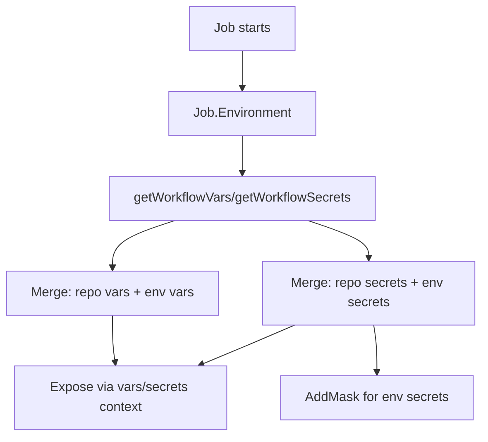

# Technical Plan: GitHub Actions Environments Support in Act

## 1. Architecture Overview

The core architecture involves extending Act's existing workflow parsing, configuration loading, and context management mechanisms. The goal is to seamlessly integrate GitHub Actions environment concepts without disrupting existing functionality.

-   **Workflow Parsing:** The `Job` struct will be extended to recognize the `environment` key in workflow YAML, extracting the environment name and optional URL.
-   **Configuration Management:** A new `EnvironmentConfig` struct will store environment-specific variables and secrets. These configurations will be loaded from CLI flags.
-   **Context Resolution:** The `vars` and `secrets` contexts will be enhanced to incorporate environment-level values, ensuring correct precedence (environment > repository).
-   **CLI Interface:** New CLI flags (`--environment-var`, `--environment-secret`, `--environment-var-file`, `--environment-secret-file`) will provide the interface for users to define environment-specific configurations.

## 2. Component Breakdown

### 2.1. `pkg/model/workflow.go`

- Add `RawEnvironment yaml.Node` field to `Job` struct
- Add `JobEnvironment` struct with `Name` and `URL` fields
- Add `Environment()` method to parse `RawEnvironment` (handles string and object formats, normalizes name to lowercase)

### 2.2. `pkg/runner/runner.go`

- Add `Environments map[string]*EnvironmentConfig` to `Config` struct
- Add `EnvironmentConfig` struct with `Vars` and `Secrets` maps

### 2.3. `pkg/runner/environment_config.go` (New File)

- `ParseEnvironmentFlag(flag string) (envName, value string, err error)` - Parse `environment:value` format
- `ParseKeyValue(kv string) (key, value string, err error)` - Parse `KEY=value` format
- `LoadEnvironmentVarsFromFile(path string)` - Call `readEnvs()` for case-sensitive loading
- `LoadEnvironmentSecretsFromFile(path string)` - Call `readEnvsEx()` for case-insensitive loading

### 2.4. `cmd/root.go`

- Add CLI flags: `--environment-var`, `--environment-var-file`, `--environment-secret`, `--environment-secret-file`
- Add `processEnvironmentFlags(config *runner.Config) error` to parse flags and populate `config.Environments`

### 2.5. `pkg/runner/expression.go`

- Modify `getWorkflowVars()` to merge environment variables (environment > repository precedence)
- Modify `getWorkflowSecrets()` to merge environment secrets (environment > repository precedence)
- Log warning using `common.Logger(ctx).Warnf()` if environment not configured

### 2.6. `pkg/runner/run_context.go`

- Call `rc.AddMask(secret)` for each environment secret during job initialization

## 3. Data Flow

### 3.1. CLI to Runner Data Flow

```mermaid
graph TD
    UserCLI[User executes 'act' with CLI flags] --> RootCmd[cmd/root.go: root command]

    subgraph CLIFlagProcessing [CLI Flag Processing (cmd/root.go)]
        RootCmd --> StringArrayFlags[--environment-var, --environment-secret, --environment-var-file, --environment-secret-file]
        StringArrayFlags --> ProcessEnvFlags[processEnvironmentFlags()]
    end

    subgraph EnvConfigParsing [Environment Config Parsing (pkg/runner/environment_config.go)]
        ProcessEnvFlags --> ParseEnvFlag[ParseEnvironmentFlag(flag string)]
        ProcessEnvFlags --> ParseKeyVal[ParseKeyValue(kv string)]
        ProcessEnvFlags --> LoadEnvVarsFile[LoadEnvironmentVarsFromFile(path string)]
        ProcessEnvFlags --> LoadEnvSecretsFile[LoadEnvironmentSecretsFromFile(path string)]
    end

    ParseEnvFlag --> EnvConfigStruct[pkg/runner/runner.go: Config.Environments]
    ParseKeyVal --> EnvConfigStruct
    LoadEnvVarsFile --> EnvConfigStruct
    LoadEnvSecretsFile --> EnvConfigStruct

    subgraph WorkflowExecution [Workflow Execution (pkg/runner)]
        JobStart[Job starts in Runner] --> GetJobEnv[pkg/model/workflow.go: Job.Environment()]
        GetJobEnv --> EnvName[Environment Name (e.g., "production")]
        EnvName --> EvalExpr[pkg/runner/expression.go: getWorkflowVars()/getWorkflowSecrets()]
        EvalExpr --> AccessConfig[Access Config.Environments]
        AccessConfig --> MergeContext[Merge: Environment-level values over Repository-level]
        MergeContext --> ExposedContext[Exposed to workflow steps as ${{ vars.KEY }} or ${{ secrets.KEY }}]
        MergeContext --> MaskSecrets[pkg/runner/run_context.go: AddMask(secret)]
    end

    EnvConfigStruct --> AccessConfig
    ExposedContext --> WorkflowStepUses[Workflow step uses variables/secrets]
```

### 3.2. Workflow Execution & Context Resolution



## 4. Testing Strategy

### Unit Tests
- `pkg/model/workflow_test.go`: Parse environment field (string and object formats), case normalization
- `pkg/runner/environment_config_test.go`: Flag parsing, key=value parsing, file loading
- `pkg/runner/expression_test.go`: Variable/secret precedence, missing environment warnings

### Integration Tests
Create test workflows in `pkg/runner/testdata/`:
- `environment-simple/`: Basic vars/secrets access
- `environment-precedence/`: Verify environment overrides repository values
- `environment-multi/`: Multiple jobs with different environments
- `environment-missing/`: Job references non-existent environment
- `environment-file-loading/`: Load from files

### Manual Testing
- [ ] Verify `--environment-var production:KEY=VALUE` sets `vars.KEY`
- [ ] Verify `--environment-secret staging:API_KEY=SECRET` sets and masks `secrets.API_KEY`
- [ ] Verify environment values override repository values
- [ ] Verify warning when environment not configured
- [ ] Verify malformed flags produce clear errors
- [ ] Verify backward compatibility with existing workflows

## 5. Risks and Mitigation

### Incorrect Variable/Secret Precedence
- Unit tests for `getWorkflowVars()` and `getWorkflowSecrets()` covering all precedence scenarios
- Integration test: `environment-precedence/workflow.yml`

### Breaking Existing Workflows
- Regression testing with existing Act workflows
- Careful review of changes to `pkg/model/workflow.go` and `pkg/runner/expression.go`

### Unclear Error Messages
- Robust validation in `ParseEnvironmentFlag` and `ParseKeyValue`
- Clear, actionable error messages with correct format examples
- Unit tests for error conditions

### Inconsistent File Loading
- Use `readEnvs()` for variables (case-sensitive) and `readEnvsEx()` for secrets (case-insensitive)
- Unit and integration tests verify identical behavior to existing flags

### Secret Leakage
- Call `rc.AddMask(secret)` for each environment secret during job initialization
- Manual testing to verify masking works correctly

## 6. Implementation Details

1. **File loading:** `readEnvs(path, map)` for variables (case-sensitive), `readEnvsEx(path, map, true)` for secrets (case-insensitive). Both support dotenv and YAML.
2. **Context population:** Modify `getWorkflowVars()` and `getWorkflowSecrets()` in `pkg/runner/expression.go`.
3. **Secret masking:** Call `rc.AddMask(secret)` during job initialization.
4. **Logging:** Use `common.Logger(ctx).Warnf("message")`.
5. **Environment name normalization:** Lowercase in `Job.Environment()` and CLI flag parsing.

## 7. Next Steps

1. Phase 1: Data model and workflow parsing (`pkg/model/workflow.go`)
2. Phase 2: CLI flag parsing (`cmd/root.go`, `pkg/runner/environment_config.go`)
3. Phase 3: Context integration (`pkg/runner/expression.go`, `pkg/runner/run_context.go`)
4. Phase 4: Testing (unit, integration, manual)
5. Phase 5: Documentation
