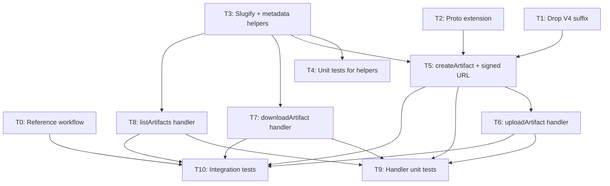

# Tasks: Artifact Server MIME Type Support

## Dependency graph



## Critical path

T0 → T1 → T2 → T3 → T5 → T6 → T9 → T10

T0 has no code dependencies and can be done first. T4 can run in parallel
with T5 once T3 is done. T7 and T8 can run in parallel with T6 once T3
is done.

## Task boundary gates

At the end of every task, before proceeding to the next:

1. **Build**: `go build ./...` must pass with no errors.
2. **Test**: `go test ./pkg/artifacts/...` must pass.
3. **Confirmation**: Wait for explicit user confirmation before starting
   the next task. Do not proceed autonomously.

---

## T0: Reference workflow for behaviour validation

**Complexity**: Low  
**Effort**: 0.5 day  
**Spec refs**: AC-11, NFR-4  
**Plan refs**: §5 (Testing)  
**Dependencies**: None

### Description

Write a GitHub Actions workflow that exercises both archive and raw
artifact upload/download paths. This workflow serves two purposes:

1. **Run in GitHub Actions** to confirm our understanding of the
   upstream protocol behaviour — what `Content-Type` the real API
   returns, how filenames are conveyed, how the download client
   distinguishes zip from raw.
2. **Run in Act** to validate our implementation against the same
   expected behaviour.

The workflow MUST be self-verifying: it uploads artifacts and then
downloads them, asserting on file content, Content-Type (via
`actions/download-artifact` behaviour), and filename preservation.

### Changes

1. **`pkg/artifacts/testdata/artifacts/zip-upload.yml`** (new file):
   - Uses `actions/upload-artifact@v4` to upload a zip archive.
   - Uses `actions/download-artifact@v4` to download and verify it.
   - Asserts downloaded file content matches original.
2. **`pkg/artifacts/testdata/artifacts/raw-upload.yml`** (new file):
   - Uses `actions/upload-artifact@v7` with `archive: false` to upload a
     raw file (e.g. a text file with known content).
   - Deliberately specifies a `name` input that differs from the filename
     to validate that the client ignores it for raw uploads.
   - Uses `actions/download-artifact@v8` to download by the filename
     (not the `name` input), verifying artifact naming behaviour.
   - Asserts downloaded file content is byte-identical (not unzipped).

### Acceptance criteria

- [ ] `zip-upload.yml` succeeds when run in GitHub Actions
- [ ] `raw-upload.yml` succeeds when run in GitHub Actions
- [ ] Both workflows are valid YAML and pass `actionlint` (if available)
- [ ] Workflows include comments explaining what behaviour they validate
- [ ] Workflows are self-contained (no external dependencies beyond
      `actions/upload-artifact` and `actions/download-artifact`)

### Test requirements

The workflows ARE the tests. They will be wired into `TestArtifactFlow`
integration tests in T10.

---

## T1: Drop V4 suffix from artifact server code

**Complexity**: Low  
**Effort**: 0.5 day  
**Spec refs**: —  
**Plan refs**: §0 (Naming changes)

### Description

Rename all `V4`-suffixed identifiers and the source file itself. This is a
pure mechanical rename with no behaviour change.

### Changes

| What | From | To |
|------|------|----|
| File | `pkg/artifacts/artifacts_v4.go` | `pkg/artifacts/artifacts.go` |
| Const | `ArtifactV4RouteBase` | `ArtifactRouteBase` |
| Const | `ArtifactV4ContentEncoding` | `ArtifactContentEncoding` |
| Func | `artifactV4Routes` | `artifactRoutes` |
| Func | `validateRunIDV4` | `validateRunID` |
| Func | `RoutesV4` | `Routes` |
| Call site | `server.go` — `RoutesV4` | `Routes` |

### Acceptance criteria

- [ ] `artifacts_v4.go` no longer exists
- [ ] `artifacts.go` contains all handler code
- [ ] `server.go` calls `Routes` (not `RoutesV4`)
- [ ] `go vet ./pkg/artifacts/...` passes
- [ ] All existing tests pass without modification

### Test requirements

No new tests. Existing `TestArtifactFlow` must pass unchanged.

---

## T2: Extend protobuf schema and add code generation

**Complexity**: Low  
**Effort**: 0.5 day  
**Spec refs**: FR-1, AC-9, AC-10  
**Plan refs**: §1 (Protocol layer)

### Description

Add the two missing fields to `artifact.proto`, add a `generate.go` file
with a `//go:generate` directive, and regenerate `artifact.pb.go`.

### Build-time tool dependencies

Code generation requires two CLI tools that are NOT Go module
dependencies:

- **`protoc`** (protobuf compiler): The existing `.pb.go` was generated
  with `protoc v4.25.2`. Use the same version to avoid diff churn.
- **`protoc-gen-go`** (Go code generator): The existing `.pb.go` was
  generated with `protoc-gen-go v1.32.0`. Install via
  `go install google.golang.org/protobuf/cmd/protoc-gen-go@v1.32.0`.

The Go runtime dependency `google.golang.org/protobuf v1.36.9` is
already in `go.mod` and does NOT need to be added.

No `generate.go` file exists anywhere in the project — the existing
`.pb.go` was generated manually or upstream in Gitea. This task creates
the first one.

### Changes

1. **`pkg/artifacts/artifact.proto`**:
   - `CreateArtifactRequest`: add `google.protobuf.StringValue mime_type = 6;`
   - `ListArtifactsResponse_MonolithArtifact`: add `google.protobuf.StringValue digest = 7;`
2. **`pkg/artifacts/generate.go`** (new file):
   - `//go:generate protoc` directive. No existing `generate.go` files
     exist in the project to use as a template — write a minimal one
     targeting `artifact.proto` with `--go_out` and `--go_opt=paths=source_relative`.
3. **`pkg/artifacts/artifact.pb.go`**: regenerated output.

### Acceptance criteria

- [ ] `mime_type` field exists at field number 6 on `CreateArtifactRequest`
- [ ] `digest` field exists at field number 7 on `MonolithArtifact`
- [ ] `version` remains `int32` at field number 5 (no change — verify)
- [ ] `go generate ./pkg/artifacts/...` succeeds
- [ ] Generated code has `GetMimeType()` and `GetDigest()` getters
- [ ] `go vet ./pkg/artifacts/...` passes
- [ ] Existing tests pass (proto is wire-additive; no breakage)

### Test requirements

No new tests. Existing tests must still pass.

---

## T3: Implement slugification and metadata helpers

**Complexity**: Medium  
**Effort**: 1 day  
**Spec refs**: NFR-3, NFR-5, AC-12, AC-13, AC-14  
**Plan refs**: §2 (Storage layer), §2.5 (Slugification)

### Description

Implement the `slugify` function, the `artifactMetadata` struct, and the
`writeMetadata`/`readMetadata` helpers that underpin the new storage layout.

### Changes

All in `pkg/artifacts/artifacts.go` (or a new `pkg/artifacts/metadata.go`
if preferred for readability — implementer's choice).

#### `slugify(name string) string`

Algorithm:
1. Compute `SHA256(original)` as a full 64-character hex string. This
   becomes the prefix.
2. Lowercase the input.
3. Replace any character not in `[a-z0-9.\-]` with `-`.
4. Collapse consecutive hyphens.
5. Trim leading/trailing hyphens.
6. Truncate to 32 characters (at a hyphen boundary if possible). This
   becomes the human-readable suffix.
7. Return `<hash>-<suffix>`.

The full SHA256 prefix enables direct path construction for downloads —
no directory scan required. The human-readable suffix aids debugging.

Both artifact directory names and content filenames are slugified.

#### `artifactMetadata` struct

```go
type artifactMetadata struct {
    MimeType         string `json:"mime_type"`
    ArtifactName     string `json:"artifact_name"`
    OriginalFilename string `json:"original_filename"`
}
```

#### `writeMetadata(path string, m artifactMetadata) error`

Write atomically: write to a temp file in the same directory, then
`os.Rename` to `metadata.json`.

#### `readMetadata(path string) (artifactMetadata, error)`

Read and JSON-unmarshal. Return a clear error if the file is missing.

### Acceptance criteria

- [ ] `slugify("")` returns a hash-only slug (no suffix, no trailing hyphen)
- [ ] `slugify("My Report.pdf")` produces a deterministic, filesystem-safe string
- [ ] Same input always produces same output (deterministic)
- [ ] Different inputs produce different outputs (collision-resistant)
- [ ] Output contains only `[a-z0-9.\-]`
- [ ] Slug starts with full 64-character SHA256 hex prefix
- [ ] Human-readable suffix is at most 32 characters
- [ ] `writeMetadata` + `readMetadata` round-trips correctly
- [ ] `writeMetadata` is atomic (partial writes don't corrupt)
- [ ] `readMetadata` on missing file returns an error (not zero-value)

### Test requirements

See T4.

---

## T4: Unit tests for slugification and metadata helpers

**Complexity**: Low  
**Effort**: 0.5 day  
**Depends on**: T3  
**Spec refs**: AC-12, AC-13, AC-14  
**Plan refs**: §5 (Testing — TestSlugify, TestWriteReadMetadata)

### Description

Unit tests for the helpers introduced in T3.

### Tests

#### `TestSlugify`

| Input | Assertion |
|-------|-----------|
| `"My Report.pdf"` | Matches `^[a-f0-9]{64}-[a-z0-9.\-]+$` |
| `"my-report.pdf"` | Matches pattern, differs from CamelCase variant only in suffix |
| `"..."` (only special chars) | Still produces a valid slug (hash-only) |
| `""` (empty) | Produces a valid slug (hash-only) |
| `"a"` repeated 100 times | Suffix truncated to ≤32 chars |
| Two distinct inputs | Produce distinct slugs |
| Same input twice | Produce identical slugs |
| `"../../etc/passwd"` | Contains no `/` or `..` sequences |

#### `TestWriteReadMetadata`

- Round-trip: write then read, assert equality.
- Atomic: concurrent write doesn't produce corrupt JSON (write to temp, rename).
- Missing file: `readMetadata` returns error.

#### `TestArtifactNameWithSpecialChars`

- Names containing spaces, unicode, slashes, dots are slugified safely.
- Original names are preserved in metadata.

### Acceptance criteria

- [ ] All table-driven test cases pass
- [ ] No filesystem artifacts left after tests (use `t.TempDir()`)
- [ ] Tests run in < 1 second

---

## T5: Update `createArtifact` handler and signed URL generation

**Complexity**: Medium  
**Effort**: 1.5 days  
**Depends on**: T1, T2, T3  
**Spec refs**: FR-2, FR-5, NFR-3, AC-1, AC-2  
**Plan refs**: §3 (Handler layer — createArtifact), §4 (Signed URL changes)

### Description

Modify `createArtifact` to read `mime_type` from the request, determine
the content filename, slugify both the artifact directory and the content
filename, write `metadata.json`, and update `buildArtifactURL` /
`verifySignature` to carry the slugified content filename through to
`uploadArtifact`.

### Implementation notes

**Distinguishing raw vs archive uploads.** The `@actions/artifact` client
decides server-side behaviour through two signals sent together:

- `version`: always `4` for `@v4`, always `7` for `@v7`.
- `mime_type`: only sent by `@v7`. When `archive: true` (the default),
  the client zips the content and sends `mime_type: "application/zip"`.
  When `archive: false`, the client sends the detected MIME type of the
  single file (e.g. `"application/pdf"`).

Therefore the content filename logic is:

| Condition | Content filename | Rationale |
|-----------|-----------------|-----------|
| `version ≥ 7` AND `mimeType != "application/zip"` | `req.Name` | Raw upload — client overrides `name` to `basename(file)` |
| `version ≥ 7` AND `mimeType == "application/zip"` | `req.Name + ".zip"` | v7 archive upload |
| `version < 7` (or absent) | `req.Name + ".zip"` | v4 always archives |

This is NOT a heuristic — it mirrors the client's own upload logic.
The MIME type is the *only* reliable signal; there is no separate
`skipArchive` field in the protocol.

**Existing code to modify.** The current `createArtifact` (around line
268 of `artifacts_v4.go`, renamed to `artifacts.go` by T1) does:

```go
filePath := fmt.Sprintf("%s/%s/%s.zip", baseDir, runID, artifactName)
```

This hardcoded `.zip` path must be replaced with the slugified layout:

```
<baseDir>/<runID>/<slugify(artifactName)>/content/<slugify(contentFilename)>
```

The empty file created by `OpenWritable` is a placeholder for the
subsequent `uploadArtifact` call. In the new layout, the placeholder goes
at `content/<slugFile>` and `metadata.json` is written alongside it.

**Signed URL changes.** The function `buildArtifactURL` (in the current
`artifacts.go`, renamed from `artifacts_v4.go` in T1) constructs URLs
like:

```
http://<AppURL>/<prefix>/<endpoint>?sig=<hmac>&expires=<time>&artifactName=<name>&taskID=<id>
```

The HMAC is computed over `endpoint + expires + artifactName + taskID`
using a hardcoded key (`{0xba, 0xdb, 0xee, 0xf0}`). Verification
happens in `verifySignature`, which extracts these four query parameters
and recomputes the HMAC.

`buildArtifactURL` needs a new optional parameter for the slugified
content filename. For upload URLs:

```
...&artifactName=<name>&taskID=<id>&filename=<slugFile>
```

The `filename` parameter MUST be included in the HMAC input to prevent
tampering. Update both `buildArtifactURL` and `verifySignature`:

- `buildArtifactURL(endpoint, artifactName, taskID, filename string)` —
  add `filename` to the URL and to the HMAC input. Pass `""` for
  download URLs.
- `verifySignature` — extract and verify `filename` from query params.
  Return it alongside `taskID` and `artifactName`.

Download URLs do NOT need the `filename` parameter because the download
handler resolves the filename from `metadata.json` (see T7). Pass `""`
for filename when building download URLs, and ensure the HMAC still
works when the parameter is absent (sign the empty string).

This changes the HMAC inputs, which means URLs signed before the change
are invalid. This is fine — signed URLs are ephemeral (generated during
`createArtifact`, consumed within the same workflow run). There is no
cross-run URL reuse.

### Behaviour

1. Read `req.GetMimeType().GetValue()`. If empty or nil, default to
   `"application/zip"`.
2. Determine content filename using the table above.
3. Slugify the artifact name for the directory.
4. Slugify the content filename.
5. Create `<baseDir>/<runId>/<slugDir>/content/` directory tree.
6. Write `metadata.json` with `{mime_type, artifact_name: req.Name, original_filename}`.
7. Return a signed upload URL that includes a `filename=<slugFile>` query
   param so `uploadArtifact` knows where to write.

### Acceptance criteria

- [ ] `mime_type` from request is persisted to `metadata.json`
- [ ] Missing `mime_type` defaults to `"application/zip"` (EC-1, EC-2)
- [ ] Directory tree uses slugified names
- [ ] `metadata.json` contains original artifact name and filename
- [ ] Signed URL includes `filename` query parameter
- [ ] Existing v4-style creates still work (backward compat)

### Test requirements

See T9.

---

## T6: Update `uploadArtifact` handler

**Complexity**: Low  
**Effort**: 0.5 day  
**Depends on**: T5  
**Spec refs**: FR-4, AC-3  
**Plan refs**: §3 (Handler layer — uploadArtifact)

### Description

Modify `uploadArtifact` to write the uploaded content to
`content/<slugFile>` instead of hardcoding a `.zip` extension.

### Implementation notes

**Existing chunked upload protocol.** The current `uploadArtifact`
handler (around line 298 of the current file) uses a query parameter
`comp` to distinguish operations:

| `comp` value | Action |
|-------------|--------|
| `"block"` | Create/overwrite the file — uses `OpenAppendable` (which creates the file if absent, seeks to end) then copies request body |
| `"appendBlock"` | Append to existing file — same `OpenAppendable` + copy |
| `"blocklist"` | Finalize — returns `201 Created`, no file I/O |

Both `block` and `appendBlock` use `OpenAppendable`, which calls
`os.OpenFile` with `O_CREATE|O_RDWR` then `Seek(0, io.SeekEnd)`. The
client sends chunks sequentially; there is no `Content-Range` parsing or
offset tracking — each chunk is simply appended.

**What changes.** The ONLY change is the file path. Currently:

```go
filePath := fmt.Sprintf("%s/%s/%s/%s.zip", baseDir, taskID, artifactName, artifactName)
```

This becomes:

```go
filePath := fmt.Sprintf("%s/%s/%s/content/%s", baseDir, taskID, slugDir, filename)
```

Where `filename` is the slugified content filename from the `filename`
query parameter (set during `createArtifact` in T5).

The `comp` handling, `OpenAppendable` calls, and body copy logic remain
**entirely unchanged**. No new chunking logic is needed.

**Verification approach.** The `verifySignature` function returns
`(taskID int64, artifactName string, ok bool)`. After this change,
`artifactName` from the signature is the *original* name. You must
slugify it to get the directory, and read `filename` from the query
params for the content filename.

### Behaviour

1. Extract `filename` query param from the signed URL.
2. Write the request body to `<artifactDir>/content/<filename>`.
3. Chunked upload protocol is unchanged — append bytes to the same file
   using the existing offset/range logic.

### Acceptance criteria

- [ ] Raw file bytes are written to `content/<slugFile>`
- [ ] Chunked uploads still work (offset handling unchanged)
- [ ] Uploaded file is byte-identical to what the client sent (AC-3)
- [ ] No `.zip` extension hardcoded

### Test requirements

See T9.

---

## T7: Update `downloadArtifact` handler

**Complexity**: Medium  
**Effort**: 1 day  
**Depends on**: T3  
**Spec refs**: FR-3, AC-4, AC-5  
**Plan refs**: §3 (Handler layer — downloadArtifact)

### Description

Modify `downloadArtifact` to read `metadata.json`, set `Content-Type`
from stored MIME type, and set `Content-Disposition` with the original
filename.

### Implementation notes

**Artifact directory resolution.** The download handler receives the
artifact name via `verifySignature`, which returns the *original*
(unslugged) artifact name from the signed URL's `artifactName` query
parameter. To find the artifact directory on disk:

1. Slugify the artifact name: `slugDir := slugify(artifactName)`
2. Build the path: `<baseDir>/<taskID>/<slugDir>/`
3. Read `<slugDir>/metadata.json` to get the content filename and MIME
   type.
4. Slugify `metadata.OriginalFilename` to find the content file:
   `<slugDir>/content/<slugify(metadata.OriginalFilename)>`

There is no lookup table or directory scan — it is pure deterministic
recomputation, same as every other handler.

**Existing code.** The current `downloadArtifact` (around line 421)
does:

```go
file := fmt.Sprintf("%s/%s/%s/%s.zip", baseDir, taskID, artifactName, artifactName)
f, _ := rfs.Open(file)
io.Copy(w, f)
```

Note: the current code sets **no headers at all** — no Content-Type, no
Content-Disposition. `net/http` may sniff the Content-Type, which is
unreliable. The new code MUST explicitly set both headers before writing
the response body.

**Content-Disposition.** Use the RFC 6266 format:
`attachment; filename="<original_filename>"`. The filename is the
*original* unslugged filename from metadata, NOT the slugified one.

### Behaviour

1. Resolve the artifact directory from the slugified name.
2. Read `metadata.json`.
3. Set `Content-Type` header to `metadata.MimeType`.
4. Set `Content-Disposition: attachment; filename="<original_filename>"`.
5. Serve the file from `content/<slugFile>`.
6. Do NOT rely on `net/http` content sniffing — always set headers
   explicitly.

### Acceptance criteria

- [ ] `Content-Type` matches stored MIME type
- [ ] `Content-Disposition` contains original (unslugged) filename
- [ ] Raw files served without zip wrapping
- [ ] Zip files still served correctly
- [ ] Headers set explicitly, not via sniffing

### Test requirements

See T9.

---

## T8: Update `listArtifacts` handler

**Complexity**: Low  
**Effort**: 0.5 day  
**Depends on**: T3  
**Spec refs**: NFR-3  
**Plan refs**: §3 (Handler layer — listArtifacts)

### Description

Modify `listArtifacts` to walk the new directory layout, reading
`metadata.json` from each artifact directory to return the original
artifact name.

### Behaviour

1. Walk `<baseDir>/<runId>/`.
2. For each subdirectory, read `metadata.json`.
3. Use `metadata.ArtifactName` as the artifact name in the response
   (not the slugified directory name).
4. Skip directories without `metadata.json` (corrupted or foreign).

### Acceptance criteria

- [ ] Returns original artifact names, not slugified names
- [ ] Handles empty run directories gracefully
- [ ] Skips directories without `metadata.json`
- [ ] Response format unchanged from client's perspective

### Test requirements

See T9.

---

## T9: Handler unit tests

**Complexity**: Medium  
**Effort**: 1.5 days  
**Depends on**: T5, T6, T7, T8  
**Spec refs**: NFR-2, AC-1 through AC-8  
**Plan refs**: §5 (Testing — handler unit tests)

### Description

Unit tests covering all handler changes from T5–T8.

### Tests

| Test name | Covers | Key assertions |
|-----------|--------|----------------|
| `TestCreateArtifactWithMimeType` | T5, AC-1 | MIME stored in metadata.json |
| `TestCreateArtifactDefaultMimeType` | T5, AC-2, EC-1 | Missing MIME → application/zip |
| `TestUploadRawFile` | T6, AC-3 | Bytes identical, no .zip assumption |
| `TestDownloadArtifactContentType` | T7, AC-4 | Content-Type from metadata |
| `TestDownloadArtifactContentDisposition` | T7, AC-4 | Filename in header is original |
| `TestListArtifactsNewLayout` | T8 | Original names returned |
| `TestUploadAndDownloadZip` | T5–T7, AC-5 | Existing zip workflow intact |
| `TestSignedURLFilenameParam` | T5 | Upload URL has filename param |

### Acceptance criteria

- [ ] All tests pass
- [ ] Tests cover: raw upload, zip upload, missing MIME, explicit MIME
- [ ] Tests use `t.TempDir()` for isolation
- [ ] No dependency on external services or network
- [ ] Tests run in < 5 seconds total

---

## T10: Integration tests with YAML workflow fixtures

**Complexity**: Medium  
**Effort**: 1 day  
**Depends on**: T5, T6, T7, T8  
**Spec refs**: NFR-4, AC-7, AC-8, AC-11  
**Plan refs**: §5 (Testing — integration tests)

### Description

Add committed YAML workflow fixtures and wire them into the existing
`TestArtifactFlow` integration test runner.

### Changes

1. **`pkg/artifacts/testdata/artifacts/zip-upload.yml`**: Workflow that
   uploads a zip artifact via `actions/upload-artifact@v4` and downloads
   it via `actions/download-artifact@v4`.
2. **`pkg/artifacts/testdata/artifacts/raw-upload.yml`**: Workflow that
   uploads a raw file via `actions/upload-artifact@v7` with
   `archive: false` and downloads it via `actions/download-artifact@v8`.
3. **`pkg/artifacts/server_test.go`**: Wire new fixtures into
   `TestArtifactFlow` or add parallel test functions.

### Acceptance criteria

- [ ] `zip-upload.yml` exercises the v4 upload/download path
- [ ] `raw-upload.yml` exercises the v7 raw upload/download path
- [ ] Both workflows complete successfully in the test harness
- [ ] Downloaded artifacts match uploaded content
- [ ] Existing `TestArtifactFlow` with `testdata/v4/artifacts.yml` still passes
- [ ] Fixtures are committed, not generated

### Test requirements

Self-contained — this task IS the integration test task.

---

## Summary

| Task | Description | Effort | Depends on |
|------|-------------|--------|------------|
| T0 | Reference workflow | 0.5d | — |
| T1 | Drop V4 suffix | 0.5d | — |
| T2 | Proto extension + codegen | 0.5d | — |
| T3 | Slugify + metadata helpers | 1d | — |
| T4 | Helper unit tests | 0.5d | T3 |
| T5 | createArtifact + signed URL | 1.5d | T1, T2, T3 |
| T6 | uploadArtifact handler | 0.5d | T5 |
| T7 | downloadArtifact handler | 1d | T3 |
| T8 | listArtifacts handler | 0.5d | T3 |
| T9 | Handler unit tests | 1.5d | T5–T8 |
| T10 | Integration tests | 1d | T0, T5–T8 |
| **Total** | | **9d** | |

## Spec coverage matrix

| Acceptance Criterion | Task(s) |
|----------------------|---------|
| AC-1: mime_type deserialized | T2, T5 |
| AC-2: absent mime_type no error | T5 |
| AC-3: raw file byte-identical | T6 |
| AC-4: Content-Type + Content-Disposition | T7 |
| AC-5: zip archives unchanged | T5, T7, T9 |
| AC-6: V1 downloads() unaffected | — (out of scope) |
| AC-7: existing tests pass | T1, T2, T9, T10 |
| AC-8: new tests | T4, T9, T10 |
| AC-9: version field int32 | T2 (verify only) |
| AC-10: digest field on MonolithArtifact | T2 |
| AC-11: YAML fixtures | T0, T10 |
| AC-12: slugified paths | T3, T5 |
| AC-13: slugification deterministic | T3, T4 |
| AC-14: original names in metadata.json | T3, T5, T8 |
